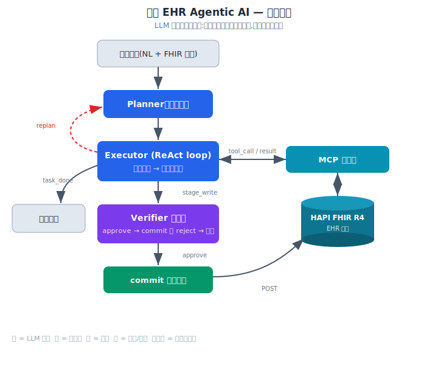
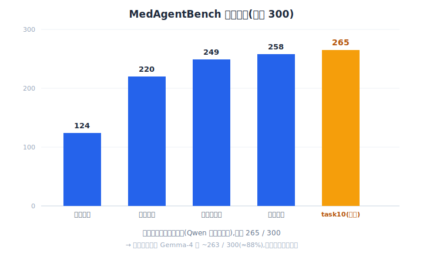
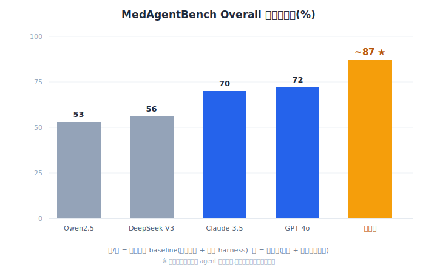

# 醫療 EHR Agentic AI — MedAgentBench

## 設計概念
有別於「問一句、答一句」的聊天式 AI,本專案打造的是 **agentic AI**:由 LLM **自己規劃步驟、決定呼叫哪個工具、執行臨床任務、並在寫入病歷前自我把關**。整套系統**完全自架於本地 RTX 4090**,不依賴任何雲端 LLM API,驗證「中型開源模型 + 良好工具設計」也能在嚴謹的醫療情境中可靠運作。

## 專案簡介
系統在模擬的 **FHIR 電子病歷(EHR)環境**中,執行查詢與寫入兩類臨床任務(如查最新血糖、記錄血壓、開立檢驗/轉診醫囑)。採 **Planner–Executor–Verifier 三角色**的 agent 架構,並以史丹佛的 **MedAgentBench(300 題、10 類臨床任務)** 作為客觀評測標準,用其官方評分程式打分。

## 系統架構 / Demo
- **Planner**:把臨床任務拆解成有序步驟。
- **Executor(ReAct loop)**:逐步呼叫工具、依結果調整。
- **Verifier**:寫入病歷前的安全閘門,審核每一筆 staged write 才允許 commit。
- **工具層**:透過 **MCP** 串接 HAPI FHIR R4 伺服器,所有讀寫都走標準 FHIR API。
- 附本地 Web Demo(LAN 內以瀏覽器操作 agent,觀察 Plan 與每步 timeline)。

## 使用技術
- **LLM**:**Gemma-4-26B-A4B-it(QAT Q4,Google)**,以 **llama.cpp** 自架於 RTX 4090(原型以 Qwen3.6 開發,因法規合規遷移至 Gemma)
- **Agent 架構**:Planner / Executor(ReAct)/ Verifier 三角色協作
- **工具與資料**:**MCP**(fhir-mcp-server)、**HAPI FHIR R4**
- **寫入安全**:兩階段 `stage → commit` + Verifier 把關 + 醫療碼/劑量驗證
- **評測**:MedAgentBench 官方 refsol grader(300 題)
- **其他**:Python、Flask Web Demo

## 成效亮點
- **MedAgentBench 官方評分:~88%(259–263 / 300,部署模型 Gemma-4;Qwen3.6 基準 265 / 300)**,**高於論文公布的最佳 baseline(GPT-4o 72%、Claude 3.5 Sonnet 70%)**。(9 類穩定 258/270;task10 因 Gemma 輸出不穩在 1–5 跳,故以範圍誠實表述)
- 讀取類任務近滿分;**寫入類任務經 FHIR 形狀對齊後 task3/task8 達 30/30**。
- **誠實註記**:此 88% 反映的是「**為此 benchmark 對齊過的 agent 系統**」在官方 grader 上的表現,而非模型原始能力的純比較(論文以標準 harness 測未調校模型)。能分辨「系統表現」與「模型能力」,正是本專案的工程價值之一。
- **模型可移植性 / 法規合規**:因應台灣法規,將底層 LLM 從 Qwen(中國)遷移至 **Gemma-4(Google/美國)**;由於系統與模型解耦(工具走 MCP、角色靠 prompt),**切換幾乎零程式改動,分數近乎持平(265 → 263)** —— 證明系統不綁單一模型。
- **task10 的誠實說明(工程誠信)**:Gemma 在 task10(條件下單 + `[值, 時間]` 特殊格式)正確率較低(5/30,Qwen 為 17/30)。經調查,**Gemma 的值與時間都算對,只是輸出時會洩漏 reasoning / markdown 污染答案**,屬 Gemma-4-26B 的已知限制(Google 文件亦載明大模型即使關閉 thinking 仍偶爾冒)。可用「task10 專屬 regex」強行修分,但那是**對 benchmark 特定題打補丁**;因此**選擇保留誠實成績、不 hack** —— 乾淨的方法與可信度,優先於多幾分。

## 未來可擴展性
- 以**真實藥品碼查詢工具(NDC/SNOMED/LOINC)** 取代目前由題目提供代碼,提升真實場景的自主性。
- 擴展至更多臨床任務類型與多步條件決策(目前剩餘失分集中於需多步推理的條件醫囑)。
- 對接真實 EHR、加入更嚴格的臨床安全規則與稽核軌跡。

## 開發歷程(關鍵問題與解法)
- **問題**:寫入任務全數失敗,agent 產生的 FHIR 資源與官方 grader 期望的形狀不符。**解決方式**:讓工具接受題目情境提供的代碼/數值/時間,verbatim 帶入 FHIR 資源(code passthrough),task3 由 0→30。
- **問題**:安全閘 Verifier 看不到完整 staged 資源,只憑一行摘要就誤拒正確寫入。**解決方式**:讓 staged 摘要帶上完整 FHIR resource,Verifier 能真正檢視內容,task8 由 0→30。
- **問題**:用「只重跑失敗題」評估,把被改壞的題目當已過略過,造成分數假象(虛高至 274,實際全跑僅 249)。**解決方式**:改為**只信完整 300 題全跑**作為唯一基準。
- **問題**:為某類題加的全域格式提示,被模型過度套用而弄壞另外三類(全跑 −50)。**解決方式**:改用**針對單一類別的 targeted 提示**,零附帶傷害地修好目標題。

## 返回主頁
